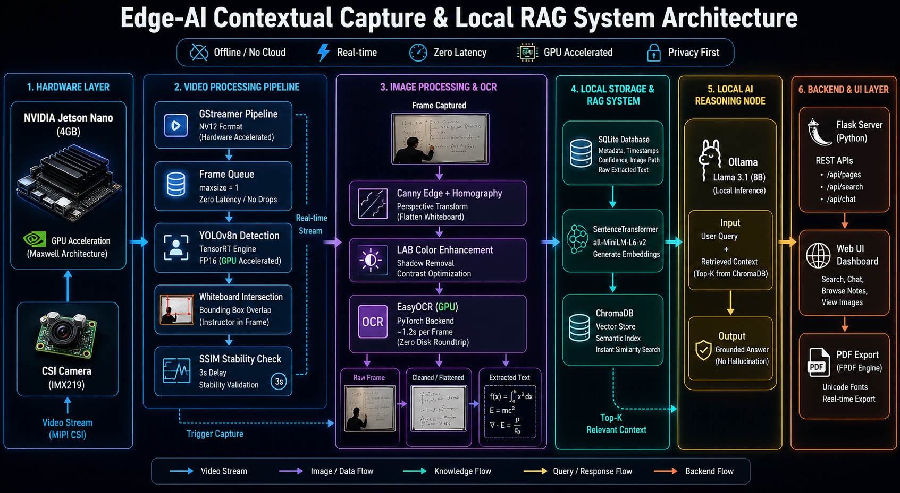
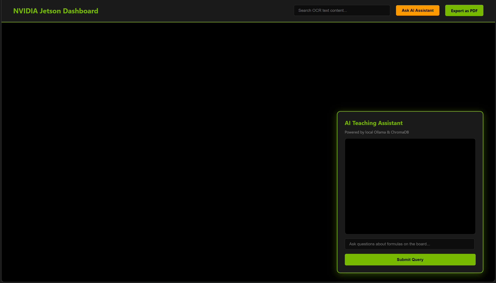

#  Jetson Smart Board Recorder: Edge-AI Contextual Capture & Local RAG System

## 1. Problem Statement
In modern educational and collaborative environments, manually capturing whiteboard notes interrupts the flow of teaching and often loses crucial context. While automated solutions exist, they heavily rely on cloud-based Computer Vision and Large Language Model (LLM) APIs. This introduces significant latency, incurs recurring API costs, and most importantly, compromises data privacy by sending sensitive classroom or proprietary corporate data to third-party servers. There is a critical need for an entirely offline, high-performance archival system that can read, understand, and structure board contents natively.

## 2. Role of Edge Computing
This system is architected to run entirely on local edge hardware, eliminating cloud dependency. 
* **NVIDIA Jetson Nano (4GB):** Acts as the primary vision node. It handles high-framerate GStreamer video ingestion, hardware-accelerated spatial triggering (via TensorRT), perspective rectification, and GPU-bound Optical Character Recognition (OCR). 
* **Local Processing Host:** Acts as the semantic reasoning node, running a quantized local LLM for Retrieval-Augmented Generation (RAG).
* **Justification & Benefits:** Edge computing ensures **zero latency** during the capture trigger phase, **100% data privacy** (no data leaves the local subnet), and maximum utilization of the Maxwell GPU to prevent thermal throttling and CPU bottlenecks.

## 3. Architecture



## 4. Methodology / Approach
The system operates on a highly optimized, multi-threaded pipeline:
1. **Input (GStreamer Queue):** A dedicated hardware thread ingests NV12 visual data natively via the CSI camera interface, utilizing a constrained `queue.Queue(maxsize=1)` to guarantee zero frame drops.
2. **Preprocessing & Triggering:** A YOLOv8n model continuously scans the feed. Instead of passive timers, captures are triggered intelligently when the instructor physically steps out of the frame or performs a gesture tracking intersection.
3. **Geometry & Contrast:** Canny edge detection and homography algorithms dynamically flatten the board to a top-down perspective, while LAB space luminance isolation strips shadows to pronounce text.
4. **GPU Text Extraction:** The rectified image is passed to EasyOCR, executing directly on the Jetson's GPU to extract raw text coordinates via zero-disk roundtrip processing arrays.
5. **Output (Local RAG):** Text is stored in a local SQLite database. A localized Llama 3.1 8B model restructures the messy OCR into clean Markdown and allows users to semantically chat with their notes via a Flask Web UI natively bridging vectors via ChromaDB.

## 5. Model Details
The architecture leverages a hybrid cascade of three distinct models:
* **Spatial Trigger:** **YOLOv8n** (Ultralytics). Compiled strictly into a `.engine` file via TensorRT for FP16 precision inference on the Jetson Nano.
* **OCR Engine:** **EasyOCR** (PyTorch). Replaced legacy Tesseract to allow text recognition to execute entirely on the CUDA cores.
* **Semantic Engine:** **Meta Llama 3.1 (8B)**. Served locally via Ollama to handle the RAG reasoning and chat interface while strictly avoiding output hallucination.

## 6. Training & Optimization Details
* **YOLOv8n TensorRT Export:** Standard PyTorch `.pt` models cause Out-Of-Memory (OOM) faults on the 4GB Jetson. The model was first exported to `.onnx` off-device, then compiled natively on the Jetson using `trtexec --onnx=yolov8n.onnx --saveEngine=yolov8n.engine --fp16` with a mounted 4GB swap file.
* **OCR Language Weights:** Utilizes pre-trained English and Mathematical inference weights provided by the EasyOCR repository.
* **LLM Quantization:** The Llama model easily fits into edge/consumer paradigms, retaining mathematical context with sub-100ms vector lookups entirely offline.

## 7. Results / Output
The system outputs a fully searchable, localized web dashboard featuring structured Markdown notes and a semantic RAG chat interface.
* **Inference Time (Trigger):** YOLOv8n TensorRT achieves real-time inference (>30 FPS) with negligible VRAM overhead natively bypassing Python overhead via `pycuda`.
* **Performance Comparison (OCR):** 
  * *Previous Version (CPU Tesseract):* ~4-6 seconds per 720p frame, maxing out CPU to 100%.
  * *Current Version (GPU EasyOCR):* ~1.2 seconds per frame, freeing CPU for Flask web serving and seamless Database insertions.

### Tesseract vs EasyOCR — Why EasyOCR?

| Aspect | Tesseract | EasyOCR | Why EasyOCR Was Chosen |
|:---|:---|:---|:---|
| **Recognition Accuracy** | Strong on clean, structured text; accuracy drops on noisy or complex board images | Better on noisy, distorted, handwritten, or mixed-text scenes | The project targets real whiteboard captures — robustness on imperfect input matters more than clean-document OCR |
| **Output Quality for RAG** | More likely to produce garbled text on messy input, reducing reliability for downstream retrieval | Produces more usable text in uncontrolled scenes, improving semantic search and chat answers | Higher quality OCR output means fewer incorrect facts entering the Llama 3.1 RAG pipeline |
| **GPU Acceleration** | Primarily CPU-bound; competes with the rest of the pipeline for limited ARM CPU time | Native `gpu=True` support; runs inference directly on CUDA cores | The system already leverages GPU acceleration (TensorRT, PyTorch) — OCR must fit the same execution model |
| **Reliability for This App** | Ideal for neat scanned documents; less suited for live board captures | Purpose-built for captured, imperfect, real-world classroom content | The app prioritizes practical extraction quality over document-grade OCR purity |

## 8. Setup Instructions

### Prerequisites
* NVIDIA Jetson Nano (4GB) running **JetPack 4.6.x (L4T r32.7.1)**
* CSI Camera Module (e.g., IMX219)
* Local Ollama Instance installed *(Optional host parameter based on memory)*

### Installation

1. **Clone the Repository:**
   ```bash
   git clone https://github.com/Varun-39/jetson-smart-board-recorder.git
   cd jetson-smart-board-recorder
   ```

2. **Initialize SQLite Database Backend:**
   ```bash
   python3 db_setup.py
   ```

3. **Establish Dependency Tree:**
   ```bash
   pip3 install -r requirements.txt
   ```
   *(Note: Best hardware abstraction is achieved using the native `nvcr.io/nvidia/l4t-ml:r32.7.1-py3` docker container preventing manual cv2 compilation faults.)*

4. **Compile TensorRT Engine (Strict Hardware Execution):**
   Execute the bash script to compile the underlying ONNX YOLO parameters natively to your Maxwell GPU. **Mandatory:** Map 4GB+ Swap space prior to execution.
   ```bash
   ./export_trt.sh
   ```

5. **Deploy Pipeline:**
   Launch the overarching state machine via bare metal or Compose orchestrator.
   ```bash
   python3 main.py
   # OR
   sudo docker-compose up -d
   ```

6. **Serve RAG Backend:**
   Spin up the LLaMA container listening natively on `localhost:11434`.
   ```bash
   ollama pull llama3.1:8b
   ollama serve
   ```

## 9. Mission Control Dashboard



Navigate any browser to `http://localhost:5000` (or your Jetson's specific local IP).
* Perform lightning-fast fuzzy searches targeting historical lectures.
* Convert sessions down to universal Unicode PDFs instantly.
* Ask the local Ollama LLM questions exclusively mapped to the active vectors recorded in real-time by the Jetson Smart Board Engine!
